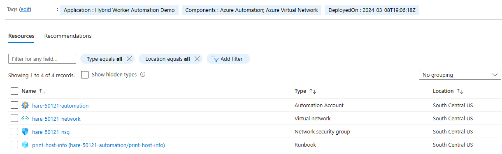
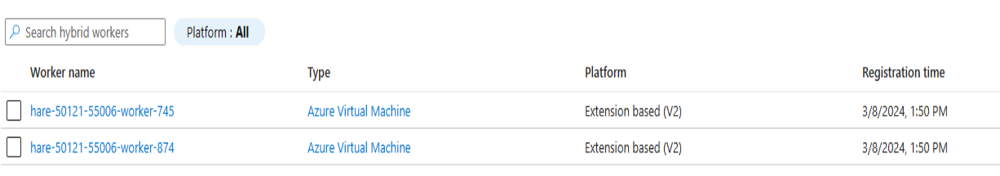
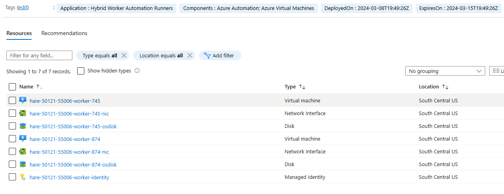
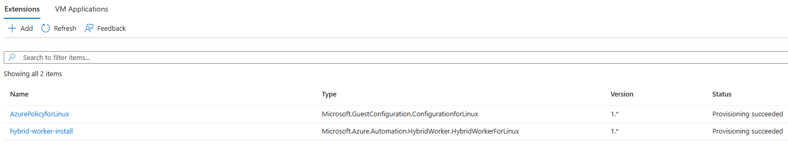

# Example Environment Overview

## Azure Automation
  

## Azure Automation Hybrid Workers Group
  

## Azure Automation Hybrid Workers
  

## Azure Virtual Machine Extensions
  

# Executing Runbooks

## Trigger Runbook via Portal
* Login in to the Azure Portal and navigate to the Azure Automation Account
* Click on the **Runbooks** blade and click on the **Test Pane** for the **print-host-info** runbook
* Select **Hybrid Workers**. Click on **Start**. Wait for the runbook to complete
* Click on the **Output** tab to see the output of the runbook. Validate that it ran on one of the Hybrid Workers

## Trigger Runbook via Azure Cli
```bash
$ az extension add --name automation
$ az vm list -o table
Name                           ResourceGroup                  Location        Zones
-----------------------------  -----------------------------  --------------  -------
tomcat-39728-38214-worker-04b  TOMCAT-39728-RUNNERS-38214_RG  southcentralus
tomcat-39728-38214-worker-a22  TOMCAT-39728-RUNNERS-38214_RG  southcentralus

$ az automation account list -g tomcat-39728_rg -o table
CreationTime                      DisableLocalAuth    LastModifiedTime                  Location        Name                     PublicNetworkAccess    ResourceGroup    State
--------------------------------  ------------------  --------------------------------  --------------  -----------------------  ---------------------  ---------------  -------
2023-12-27T18:28:47.483000+00:00  False               2023-12-27T18:28:47.483000+00:00  southcentralus  tomcat-39728-automation  True                   tomcat-39728_rg  Ok

$ az automation hrwg list  --automation-account-name tomcat-39728-automation -g tomcat-39728_rg -o table
GroupType    Name                             ResourceGroup
-----------  -------------------------------  ---------------
User         tomcat-39728-automation-workers  tomcat-39728_rg

$ az automation runbook start  --automation-account-name tomcat-39728-automation -g tomcat-39728_rg -n print-host-info --run-on tomcat-39728-automation-workers
{
  "creationTime": "2023-12-27T18:46:45.037000+00:00",
  "endTime": null,
  "exception": null,
  "id": "/subscriptions/ccfc5ddc-43af-4b5e-8cc2-1dda18f2382e/resourceGroups/tomcat-39728_rg/providers/Microsoft.Automation/automationAccounts/tomcat-39728-automation/jobs/7167118b-e8e2-4f94-9d0b-9334d2435319",
  "jobId": "aa9cae18-32c2-4127-82b9-d507e5501923",
  "lastModifiedTime": "2023-12-27T18:46:45.037000+00:00",
  "lastStatusModifiedTime": "2023-12-27T18:46:45.037000+00:00",
  "name": "7167118b-e8e2-4f94-9d0b-9334d2435319",
  "parameters": {},
  "provisioningState": "Processing",
  "resourceGroup": "tomcat-39728_rg",
  "runOn": "tomcat-39728-automation-workers",
  "runbook": {
    "name": "print-host-info"
  },
  "startTime": null,
  "startedBy": null,
  "status": "New",
  "statusDetails": "None",
  "type": "Microsoft.Automation/AutomationAccounts/Jobs"
}

$ az automation job show  --automation-account-name tomcat-39728-automation -g tomcat-39728_rg -n aa9cae18-32c2-4127-82b9-d507e5501923
Command group 'automation job' is experimental and under development. Reference and support levels: https://aka.ms/CLI_refstatus
{
  "creationTime": "2023-12-27T18:46:45.079375+00:00",
  "endTime": "2023-12-27T18:47:11.748434+00:00",
  "exception": null,
  "id": "/subscriptions/ccfc5ddc-43af-4b5e-8cc2-1dda18f2382e/resourceGroups/tomcat-39728_rg/providers/Microsoft.Automation/automationAccounts/tomcat-39728-automation/jobs/aa9cae18-32c2-4127-82b9-d507e5501923",
  "jobId": "aa9cae18-32c2-4127-82b9-d507e5501923",
  "lastModifiedTime": "2023-12-27T18:47:11.748434+00:00",
  "lastStatusModifiedTime": "2023-12-27T18:47:11.748434+00:00",
  "name": "7167118b-e8e2-4f94-9d0b-9334d2435319",
  "parameters": {},
  "provisioningState": "Succeeded",
  "resourceGroup": "tomcat-39728_rg",
  "runOn": "tomcat-39728-automation-workers",
  "runbook": {
    "name": "print-host-info"
  },
  "startTime": "2023-12-27T18:47:08.244576+00:00",
  "startedBy": "{scrubbed}",
  "status": "Completed",
  "statusDetails": "None",
  "type": "Microsoft.Automation/AutomationAccounts/Jobs"
}
```